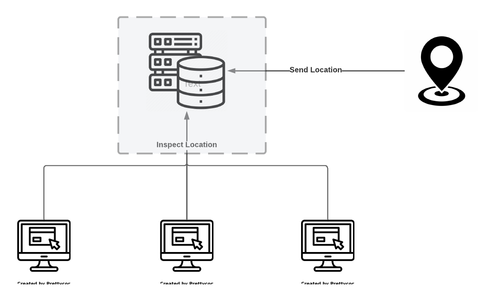

# Design API for Data

APIs and Queries that handles data filtering.



- Define well-structureed APIs

## APIs

For sake of simplicity, user authentication, data caching are removed.

### Get Current/Most Recent Location

Get current location (latitude, longitude, timestamp )

#### Request Format

```http request
GET {{base_url}}/location
```

#### Response Format

```json
{
  "timestamp": "...",
  "lat": "...",
  "lon": "..."
}

```

### Search Date and Time

Get at most 10 locations relates to given inputs

#### Request Format

```http request
GET {{base_url}}/location/search?date=&time= 
```
#### Response Format

```json
[
  {
  "timestamp": "...",
  "lat": "...",
  "lon": "..."
},
  ...
]

```
