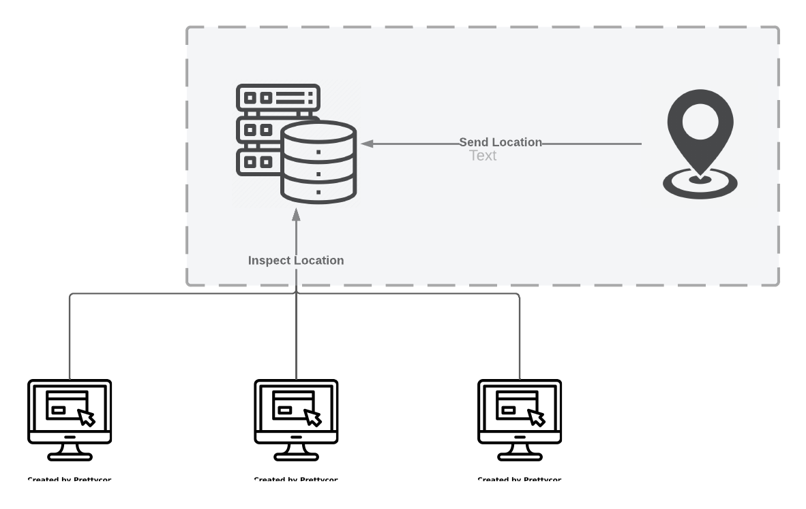
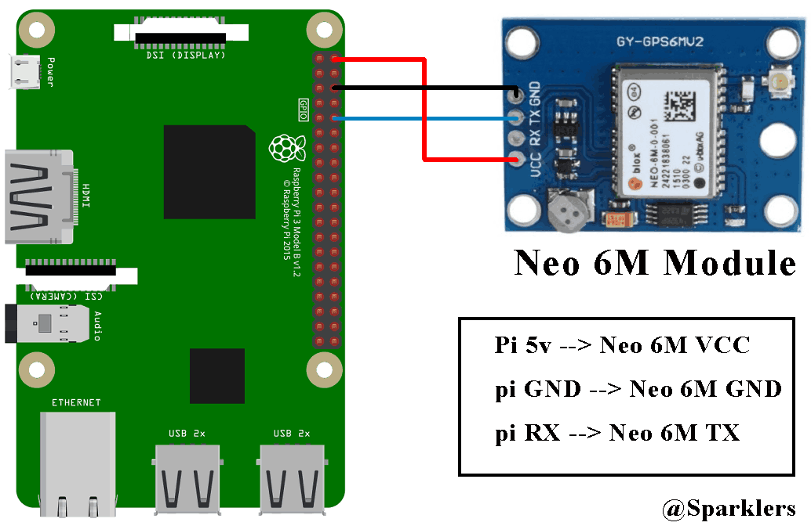

# GPS Monitoring System

Infrastructure to receive data from  **GPS** module and send it to server.



# GPS Client Side

- Use **GPS** modules to receive NMEA format data
- Parse NMEA format data into geo point (latitude, longitude).
- Send data to the Server
- Receive data from Client

## Receiving NMEA Data

Connect Neo6m module to raspberry.



### Port Mapping

- Neo 6M VCC -> Raspberry VCC

- Neo 6M GND -> Raspberry ground

- Neo 6M TX -> Raspberry RX

- Neo 6M RX -> Raspberry TX (NOT NECESSARY)

### Baud Rate Setup

Raspberry receive data at 11520 frequency by default and Neo6M transmit data at 9600 frequency by default.

To get correct data, the baud rate of two devices must be matched.

Steps:

1) Enable UART /boot/config
2) SET cmdline freq to 9600
3) Link **serial 0** into ttyAMA0

<br></br>
Sample:

run `cat /dev/ttyAMA0` to get similar results:

```shell
$GNRMC,005551.00,A,3543.93696,N,05122.60002,E,0.058,,310124,,,A*60

$GNVTG,,T,,M,0.058,N,0.107,K,A*36

$GNGGA,005551.00,3543.93696,N,05122.60002,E,1,05,1.84,1372.0,M,-17.6,M,,*56

$GNGSA,A,3,26,31,02,04,21,,,,,,,,4.46,1.84,4.06*16

$GNGSA,A,3,,,,,,,,,,,,,4.46,1.84,4.06*15

$GPGSV,3,1,12,02,45,214,20,03,64,335,,04,46,278,14,09,09,262,*72

$GPGSV,3,2,12,16,07,145,,17,04,286,,19,02,309,,21,37,198,28*78

$GPGSV,3,3,12,26,22,119,26,28,35,047,,31,60,067,20,32,04,068,*70
```

## Parse NMEA format data

Extract useful data from serial. This can be done by many parser libraries.
This implementation is done by `pynmea` lib and `RMC` data as selected inputs.

```python
import serial
from pynmeagps import NMEAReader, NMEAMessage

stream = serial.Serial(SERIAL, baudrate=9600)
nmr = NMEAReader(stream, validate=0x01)


def get_location():
    global CL
    for (raw_data, parsed_data) in nmr:
        msg: NMEAMessage = parsed_data
        pdt = msg.msgID
        if pdt == 'RMC':
            lat = None
            lon = None
            if msg.lat != "":
                lat = float(msg.lat)
            if msg.lon != "":
                lon = float(msg.lon)
            if msg.lon and msg.lat:
                logger.info("latitude : " + str(lat) + " longitude : " + str(lon))
                return lat, lon, get_timestamp()
```

## Send Data to Server

The previous parsed data must be transmitted to the server. This can be done by using simple `UDP socket` to a port
which
is listening on server.

```python
d_socket = socket.socket(socket.AF_INET, socket.SOCK_DGRAM)


def post_data(lat, lon, timestamp):
    logger.info("POST UPDATE")
    msg = f"UPDATE {timestamp} {lat} {lon}"
    d_socket.sendto(msg.encode(), SERVER_ADDRESS)

```

### Too Many Requests !!!

Sending same data over and over may cause overhead on communication.
Two policy are used for addressing this issue:

1) Every 15 sec: Check if Current Location is **Far Enough** From previous location. If yes, then send new location.
2) Every 60 sec: Push location into server. This must be done due to updating the timestamps which are used in querying
   by back-end system

The implementation is done by `schedule`:

```python
schedule.every(15).seconds.do(update_location)
schedule.every().minutes.do(update_location, force=True)


def update_location(force: bool = False):
    if not force:
        logger.info("Check location...")
    else:
        logger.info("Update location...")

    global CL
    lat, lon, timestamp = get_location()
    if not lat or not lon:
        return

    d = get_dist(lat, lon)
    if d > DIST_THRESHOLD or d < 0:
        post_data(lat, lon, timestamp)
    elif force:
        post_data(lat, lon, timestamp)

    CL = (lat, lon)
```

## Receive Data from Client

Open and bind a **UDP socket**. Listen for incoming connections.

```python
def run():
    s_socket = socket.socket(socket.AF_INET, socket.SOCK_DGRAM)
    s_socket.bind(SERVER_ADDRESS)

    while True:
        data, adr = s_socket.recvfrom(4096)
        logger.info("RECEIVE: " + data.decode())
        update_csv(data.decode())
```
